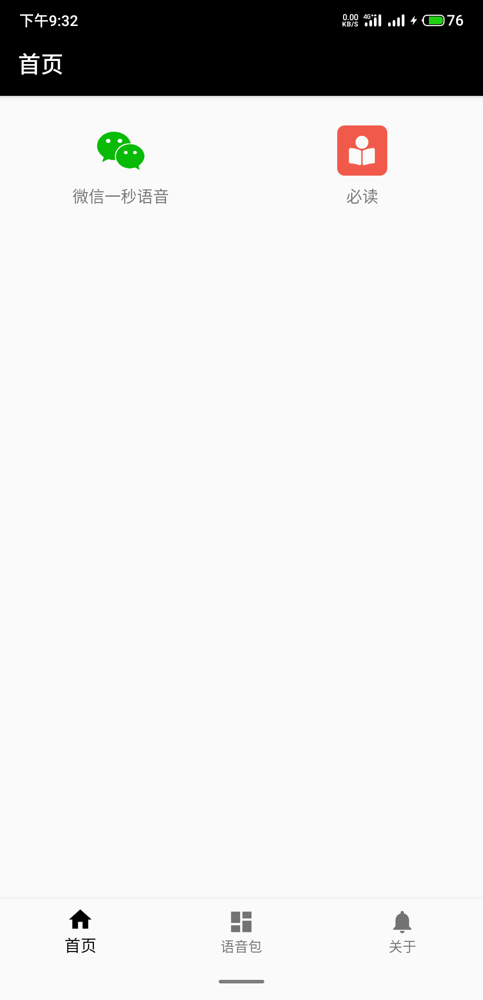
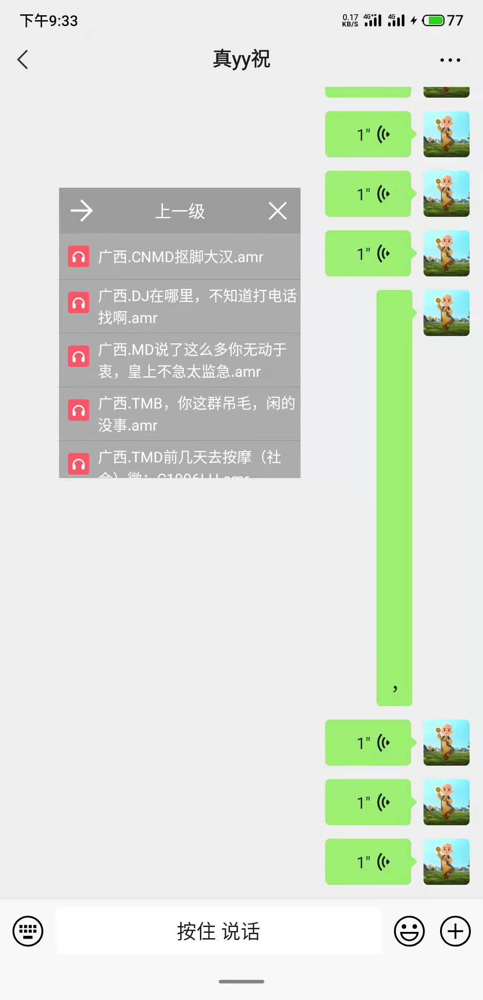

# 实现微信发送一秒的长语音

### 权限
存储: 用来读取语音包和替换语音  
悬浮窗: 显示操作的视图啊  

### 导入语音包
>把语音文件(amr格式)复制到  
>/Android/data/vip.yyzhu.ymyy/语音包/  
>这个目录就行了

### 开始
>1.首页点'微信一秒语音'(废话)  
>2.会显示一个悬浮窗(如果没有请检查悬浮窗权限)  
>3.打开微信  
>4.点击悬浮窗上要发送的语音包  
>5.看到提示'已准备, 请按下录音'后按下微信录音  
>5.看到提示'替换成功'后就可松手发送啦  

## 截图  

## 文档在完善中
